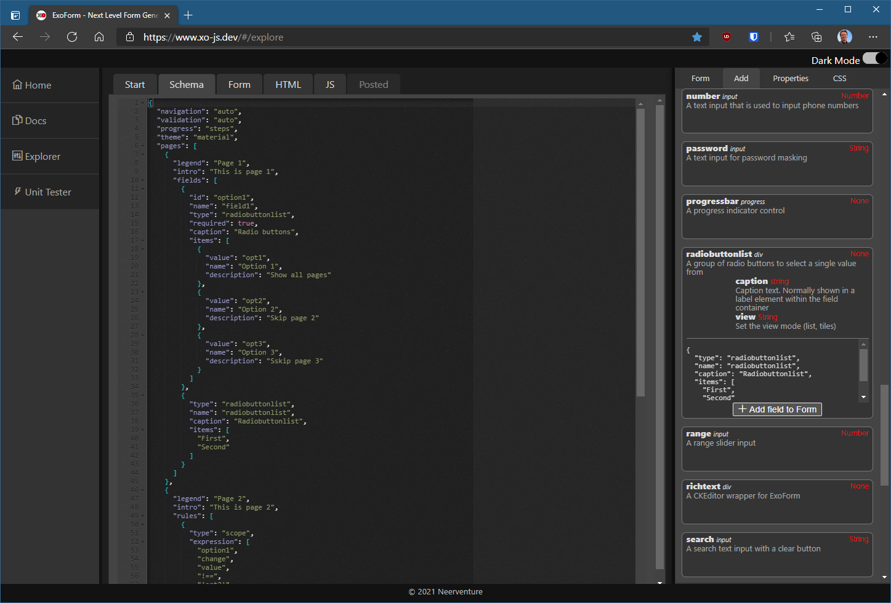
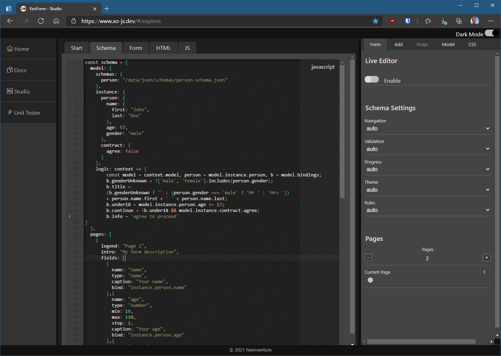
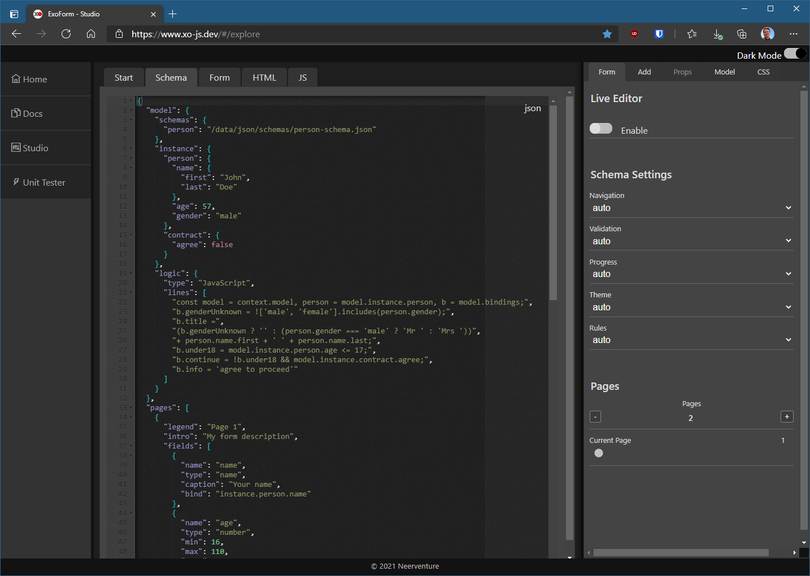

# The Problem

Large Enterprise, Multi-tenant SaaS apps are extremely configurable at all levels. Also, they need automated, self-service onboarding, in order to set the basics for a new tenant or user, manage user authorization, subscription management, and all data that the specific SaaS product needs to manage.

> Building complete front-ends in a bespoke way is a tedious, error-prone and costly undertaking.

Also, each of these developments adds overhead in terms of testing and deployment.

Lastly, maintaining consistence over all front-end facing application parts is not a small task.

# How does ExoForm solve this problem?

A way to solve all these issues at once, and speed up delivery of countless new front-end data-collecting requirements, is to have a highly flexible Forms Generator that can be fed declarative form schema data and automatically render forms.

Examples of this type of product are XForms generators, Wufoo, TypeForm, JotForms and others. 

Why develop a new one, then? 

> Well, because I've seen what developers need. They need to save as much time as needed, yet have all the power to themselves.

What does ExoForm bring?

* ExoForm gives developers complete freedom: simply include it in your development stack, and bypass, subclass, add anything you want. 
* No bulky dependencies. HTML5, CSS3, ECMAScript. That's it. They're powerful enough ;-) 
* Use it in any environment, Vue, React, Angular, or plain vanilla JavaScript. 
* Create and include your own control libraries. 
* Customize anything: validation, 
* Get typed JSON post data 
* All HTML5 controls included, plus a large number of custom controls
* Ace Code Editor, CkEditor wysiwyg editor (richt text) 
* Examples of adding your own controls at codepen.io. For example, use the [Monaco Editor](https://codepen.io/mvneerven/pen/NWdYybz).
* Autocompletion (using standard HTML5 DataLists, fixed lists, or dynamic API searches)
* Standard HTML5 & Inline validation (or roll your own)
* Wizards & other multi-page forms, Surveys, 
* Completely overridable rendering & theming
* A visual [ExoForm Explorer](https://www.xo-js.dev/#/explore) and Test Environment
  * JSON Schema editor 
  * Wysiwyg designer (in development) 
  * Jest test environment 
* [Codepen examples](https://codepen.io/collection/XLwaxp)
* Etc. 

# Using ExoForm in JavaScript

Basic JavaScript Flow:

```javascript 
const context = await window.xo.form.factory.build();
const x = context.createForm();
await x.load("/forms/myform.json");
let result = await x.renderForm();
document.body.appendChild(result.container);     
```

# New in 1.01

A big update to ExoForm, including a rewrite of navigation, progress indicating, validation and theming engines, all of which are now implemented as separate subclassable components, and activated using form schema settings (or using JavaScript code).

Also, a complete new theme has been added: material.

## Validation

Show inline validation messages to be shown instead of the default HTML5 validation popups.

```json
{
  "validation": "inline"
}
```


## Progress
Show the progress within a multi-page form.

```json
{
  "progress": "steps"
}
```


## Material Theme
A new theme, inspired by Material Design, was added.

```json
{
  "theme": "material"
}
```


## Control Additions

### Multiline: autogrow (Boolean)
Let a textarea grow automatically when the user adds more lines.

```json
{
  "pages": [
    {
      "legend": "My Form",
      "intro": "My form description",
      "fields": [
        {
          "name": "testField",
          "caption": "Autogrowing Textarea",
          "type": "multiline",
          "autogrow": true
        }
      ]
    }
  ]
}
```

### Range: showoutput (Boolean)
Show the value of a range control 

```json
{
  "pages": [
    {
      "legend": "My Form",
      "intro": "My form description",
      "fields": [
        {
          "name": "range",
          "caption": "Range Indicator",
          "type": "range",
          "showoutput": true
        }
      ]
    }
  ]
}
```

### Captcha: invisible (Boolean)
Make the Google ReCaptcha control act invisibly.

```json
{
  "pages": [
    {
      "legend": "My Form",
      "intro": "My form description",
      "fields": [
        {
          "name": "captch",
          "type": "captcha",
          "invisible": true
        }
      ]
    }
  ]
}
```


## ExoForm Explorer 
[The ExoForm Explorer](https://www.xo-js.dev/#/explore) is loaded with new functionality to experiment with all the new features.



## Distributable

To use ExoForm 1.01, use the new JS versions at:

```
https://xo-js.dev/v1.0/xo.js
https://xo-js.dev/v1.0/xo.min.js
```

... or get the latest NPM package

https://www.npmjs.com/package/@mvneerven/xo-js


# New in 1.0.32

## Fixes
-	Step is now taken into account in the number control with 'buttons' property set to true
- Required fields' labels are suffixed with a '*' (using CSS ::after), based on the container class *exf-required*


## Additions

- When building an ExoFormContext object (using the factory method *ExoFormFactory.build()*, defaults for form settings can now be passed in:

```javascript
// set default validation to be 'inline' for all forms
const context = await window.xo.form.factory.build({
    defaults: {
        validation: "inline"
    }
});
```

## Changes:
-	Custom controls must now implement a value getter and setter, instead of setting functions on the field object

```javascript
set value(data){
  // custom logic
}

get value() {
  // custom logic
}
```

## ExoForm Portal

-	The current workspace is now saved, so if you're working on a form, it will be reloaded next time you open the Explorer.
-	The dark mode switch now immediately switches Ace Editor themes


# New in 1.0.33

## Changes
- containerClass removed. Use 'class' on schema fields to set class names. All classes are added to the containing div (div.exf-ctl-cnt)

# New in 1.1.0

## Model Binding

You can now bind your ExoForm data to a model.

```json
{
  "model": {
    "instance": {
      "person": {
        "name": "Marc",
        "age": 57,
        "gender": "m"
      }
    }
  },
  "pages": [
    {
      "legend": "My Form",
      "intro": "My form description",
      "fields": [
        {
          "name": "testField1",
          "type": "text",
          "caption": "Name",
          "bind": "instance.person.name"
        },
        {
          "name": "testField2",
          "type": "number",
          "caption": "Age",
          "bind": "instance.person.age"
        },
        {
          "name": "testField3",
          "type": "dropdown",
          "caption": "Your age please, @person.name",
          "bind": "instance.person.gender",
          "items": [
            {
              "name": "Please choose",
              "value": ""
            },
            {
              "name": "Male",
              "value": "m"
            },
            {
              "name": "Female",
              "value": "f"
            },
            {
              "name": "Wish not to share",
              "value": "u"
            }
          ]
        }
      ]
    }
  ]
}
```

# New in 1.1.1

## Model Binding Extensions

### Logic 

You can now add a logic property in your forms to allow for dynamic behavior based on changes in the model.

```js
const schema = {
    model: {
        schemas: {
            person: "/data/json/schemas/person-schema.json"
        },
        instance: {
            person: {
                name: {
                    first: "John",
                    last: "Doe"
                },
                age: 57,
                gender: "male"
            },
            contract: {
                agree: false
            }
        },
        logic: context => {
            const model = context.model, person = model.instance.person, b = model.bindings;
            b.genderUnknown = !['male', 'female'].includes(person.gender);
            b.title =
                (b.genderUnknown ? '' : (person.gender === 'male' ? 'Mr ' : 'Mrs '))
                + person.name.first + ' ' + person.name.last;
            b.under18 = model.instance.person.age <= 17;
            b.continue = !b.under18 && model.instance.contract.agree;
            b.info = 'agree to proceed'
        }
    },
    pages: [
        {
            legend: "Page 1",
            intro: "My form description",
            fields: [
                {
                    name: "name",
                    type: "name",
                    caption: "Your name",
                    bind: "instance.person.name"
                }, {
                    name: "age",
                    type: "number",
                    min: 16,
                    max: 110,
                    step: 1,
                    caption: "Your age",
                    bind: "instance.person.age"
                }, {
                    name: "gender",
                    type: "dropdown",
                    disabled: "@bindings.under18",
                    caption: "Gender",
                    items: [
                        {
                            name: "Please choose",
                            value: "unknown"
                        }, {
                            name: "Male",
                            value: "male"
                        }, {
                            name: "Female",
                            value: "female"
                        }, {
                            name: "Not important",
                            value: "unspecified"
                        }
                    ],
                    bind: "instance.person.gender"
                }, {
                    name: "agree",
                    type: "checkbox",
                    caption: "I have read the <a href='/terms'>terms & conditions</a> and agree to proceed",
                    tooltip: "Check to continue",
                    bind: "instance.contract.agree"
                }, {
                    name: "info",
                    visible: "@bindings.under18",
                    type: "dialog",
                    title: "Info",
                    body: "You have to be over 18 to continue",
                    bind: "instance.contract.info"
                }
            ]
        }, {
            legend: "Page 2",
            relevant: "@instance.contract.agree",
            fields: [
                {
                    name: "why",
                    type: "multiline",
                    caption: "@bindings.title, let us know what you think..."
                }, {
                    type: "checkboxlist",
                    name: "checkboxlist",
                    caption: "Checkboxlist",
                    items: [
                        "First", "Second"
                    ]
                }
            ]
        }
    ],
    form: {

    }
}
```

## Support for JS schemes

You can now easily switch to JavaScript literal notation, which makes it easier to write logic (if you're a developer ;-).



In the upper right corner of the editor window, you can toggle between JS and JSON notation:



# New in 1.1.2

## ESBuild used

No more Babel transpiling of ES6 Code. Just plain ES6, minified and bundled by [ESBuild](https://esbuild.github.io/).

# New in 1.2.0

## Form controls in Schema

The Form Control for navigation and submit can now be optionally included in the Form schema.

```js
const schema = {
    model: {
        // ...
    },
    pages: [
        // ...
    ],
    controls: [
        {
            name: "reset",
            type: "button",
            caption: "Back to page one",
            class: "form-reset"
        },
        {
            name: "prev",
            type: "button",
            caption: "◁ Back",
            class: "form-prev"
        },
        {
            name: "next",
            type: "button",
            class: "form-next"
        },
        {
            name: "send",
            type: "button",
            caption: "Submit",
            class: "form-post"
        }
    ]
}
```

If you don't have a controls array in your schema, ExoForm will revert to the default behavior based on the selected *navigation* type. For instance, if your *navigation* setting is 'auto' (or not specified in the schema), and your schema consists of one page, the following code will be injected into the runtime schema:

```js
controls = [
  {
    name: "send",
    type: "button",
    caption: "Submit",
    class: "form-post"
  }
]
```

... while if *navigation* is set to 'wizard' (or 'auto'/missing with more than one page specified), the following code will be provisioned:

```js
controls = [
  {
    name: "prev",
    type: "button",
    caption: "◁ Back",
    class: "form-prev"
  },
  {
    name: "next",
    type: "button",
    caption: "Next ▷",
    class: "form-next"
  },
  {
    name: "send",
    type: "button",
    caption: "Submit",
    class: "form-post"
  }
];
```

Apart from having control over button classes and captions, a major benefit of the explicit *controls* markup is in combination with data binding and logic.

Look at this code for instance:

```js
controls: [
    {
        name: "reset",
        type: "button",
        caption: "Back to page one",
        class: "form-reset",
        disabled: "@bindings.isFirstPage"
    },
    {
        name: "prev",
        type: "button",
        caption: "◁ Back",
        class: "form-prev"
    },
    {
        name: "next",
        type: "button",
        caption: "Next ▷",
        class: "form-next"
    },
    {
        name: "send",
        type: "button",
        caption: "Submit",
        class: "form-post",
        disabled: "@bindings.sendDisabled"
    }
]
```

You can see that here, button state is linked to changes that are defined in the model logic:

```js
model: {
    instance: {
        person: {
            name: {
                first: "John",
                last: "Doe"
            },
            age: 57,
            gender: "male"
        },
        contract: {
            agree: false
        }
    },
    logic: context => {
        const model = context.model, person = model.instance.person, 
        b = model.bindings, nav = context.exo.addins.navigation;
        
        b.isFirstPage = nav.currentPage === 1;

        b.sendDisabled = nav.;
    }
}
```

# New in 1.2.5

## Simplified usage

There's now an extremely simple syntax to directly run a form.

```js
const x = await xo.form.run(schema);
myDiv.appendChild(x.container);
```

You still have access to most of the functionaliy:

```js
const x = await xo.form.run(schema, {
  on: {
      post: e => {
          // e.detail.postData
      },
      page: e => {
        // paging
      }
  }
});
myDiv.appendChild(x.container);
```

... providing an ExoFormContext object

```js
xo.form.run("/data/forms/account.json", {
    context: this.xoContext,
    on: {
        post: e=>{
            // handle post
        }
    }
}).then(x=>{
    myDiv.appendChild(x.container)
})
```
