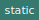

# Module `pwa/Core`

[Source file](..\..\src\pwa\Core.js)

# Class `Core`

Core utility methods

## Methods

### `clone(obj, replacer) ► `

 

Clone an object.

Parameters | Type | Description
--- | --- | ---
__obj__ | `Object` | **
__replacer__ | `function` | **
__*return*__ | `undefined` | *cloned object.*

---

### `fingerprint() ► String`

 

Generates a device fingerprint based on rendering data on a canvas element - See https://en.wikipedia.org/wiki/Canvas_fingerprinting

Parameters | Type | Description
--- | --- | ---
__*return*__ | `String` | *- An identifier known to be relatively unique per device*

---

### `dataURLtoBlob(dataurl) ► `

 

Converts a data URL to a Blob and returns a Blob URL.

Parameters | Type | Description
--- | --- | ---
__dataurl__ | `URL` | **
__*return*__ | `undefined` | *Blob URL*

---

### `blobToDataURL(blob) ► `

 

Converts a Blob into a dataUrl

Parameters | Type | Description
--- | --- | ---
__blob__ | `*` | **
__*return*__ | `undefined` | *data URL*

---

### `getObjectValue(obj, path, def) ► `

 

Parameters | Type | Description
--- | --- | ---
__obj__ | `Object` | *the object to get a property from*
__path__ | `String` | *path to the property*
__def__ | `Any` | *default to return if the property is undefined*
__*return*__ | `undefined` | *The value of the property as retrieved*

---

### `stringifyJs(jsLiteral, replacer, indent) ► `

 

Does JS code stringification comparable to JSON.stringify()

Parameters | Type | Description
--- | --- | ---
__jsLiteral__ | `Object` | *the JavaScript literal to stringify*
__replacer__ | `function` | **
__indent__ | `Number` | **
__*return*__ | `undefined` | *String*

---

### `quoteKeyIfNeeded(key) ► `

 

Returns appropriate use of the given key for identifiers

Parameters | Type | Description
--- | --- | ---
__key__ | `*` | **
__*return*__ | `undefined` | *The adequately quoted or non-quoted identifier name*

---

### `isValidVarName(name) ► `

 

Returns true if the given name is valid as variable name

Parameters | Type | Description
--- | --- | ---
__name__ | `*` | **
__*return*__ | `undefined` | *Boolean value indicating whether the given name is a valid variable name*

---

### `scopeEval(scope, script) ► `

 

Evaluates a script in the given scope

Parameters | Type | Description
--- | --- | ---
__scope__ | `Object` | *the &#x27;this&#x27; scope for the script to run in*
__script__ | `String` | *the script to execute*
__*return*__ | `undefined` | *The return value of the script, if any*

---

### `resolveVariables(str, cb, ar) ► `

 

Resolve variables in strings

Parameters | Type | Description
--- | --- | ---
__str__ | `*` | *the string to parse*
__cb__ | `*` | *callback for each var replacement*
__ar__ | `*` | *array to fill with matches*
__*return*__ | `undefined` | *the string with the resolved variables*

---

### `acquireState(data, options) ► `

 

Acquire state from multiple possible sources.

Parameters | Type | Description
--- | --- | ---
__data__ | `Any` | *input data. Can be either direct data, URL, function or Promise*
__options__ | `*` | *optional options to pass to Promise, function*
__*return*__ | `undefined` | *Object or Array*

---

### `isUrl(txt) ► `

 

Checks whether the fiven string is a valid URL.

Parameters | Type | Description
--- | --- | ---
__txt__ | `String` | *the string to evaluate*
__*return*__ | `undefined` | *Boolean indeicating whether the string is a URL.*

---

### `setObjectValue(obj, path, value)`

 

Counterpart of GetObjectValue

Parameters | Type | Description
--- | --- | ---
__obj__ | `Object` | *the object to set a shallow or deep property on*
__path__ | `String` | *the path to the property to set*
__value__ | `Any` | *the value to set*

---

### `deepMerge(obj1, obj2)`

 

Does a deep merge of two objects, whereas using the spread operator (...) only does a shallow merge.

Parameters | Type | Description
--- | --- | ---
__obj1__ | `Object` | *the object to be merged into*
__obj2__ | `Object` | *the object to be merged from*

---

### `stringToPath(path) ► `

 

Helper for GetObjectProperty and GetObjectProperty

Parameters | Type | Description
--- | --- | ---
__path__ | `String` | **
__*return*__ | `undefined` | *Array*

---

### `compare(operator, a, b) ► `

 

Compares values using the built in operator table

Parameters | Type | Description
--- | --- | ---
__operator__ | `String` | **
__a__ | `Object` | **
__b__ | `Object` | **
__*return*__ | `undefined` | *Boolean*

---

### `guid() ► `

 

Returns a random GUID

Parameters | Type | Description
--- | --- | ---
__*return*__ | `undefined` | *string (36 characters)*

---

### `waitFor(f, timeoutMs, intervalMs) ► `

 

Waits for a given condition in a promise.

Parameters | Type | Description
--- | --- | ---
__f__ | `function` | *the function to evaluate whether waiting should end*
__timeoutMs__ | `Number` | *total time to wait if the given function still doesn&#x27;t return true*
__intervalMs__ | `Number` | *interval to wait between each function evaluation (in milliseconds) - Defaults to 20.*
__*return*__ | `undefined` | *Promise that resolves when the evaluating function provided return true, or gets rejected when the timeout is reached.*

---

### `formatByteSize(size) ► `

 

Formats a number as human-friendly byte size

Parameters | Type | Description
--- | --- | ---
__size__ | `Number` | **
__*return*__ | `undefined` | *String like 20KB, 1.25MB, 6.25GB, etc.*

---

## Members

Name | Type | Description
--- | --- | ---
__Events__ | `undefined` | *Events Class*
__MarkDown__ | `undefined` | *MarkDown wrapper*
__SimpleCache__ | `undefined` | *Caching class*
