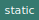

# Module `pwa/DOM`

[Source file](..\..\src\pwa\DOM.js)

# Class `DOM`

Document Object Model helper methods

## Methods

### `parseHTML(html) ► `

 

Generates an Html Element from the given HTML string

Parameters | Type | Description
--- | --- | ---
__html__ | `String` | **
__*return*__ | `undefined` | *DOM element*

---

### `elementToString(el) ► `

 

Returns string representation of HtmlElement using nodeName, id and classes

Parameters | Type | Description
--- | --- | ---
__el__ | `Object` | *the DOMM element*
__*return*__ | `undefined` | *String*

---
